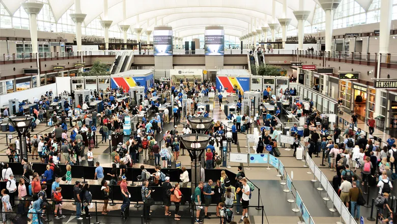

#  Flights Delays

Flights Delays cost thousands of dollars every day, for the airlines and passengers.

The following dataset contains 1936758 flights in United States in 2008, with their delays, cancelation code, or if them were diverted.

The aim is to find what are the reasons of the delays, and try to predict the delay.

The data was obteined from: https://www.kaggle.com/datasets/giovamata/airlinedelaycauses

The main keys of the project are:

* Exploratory Data Analysis
* Data Visualization
* ML models for a regression problem (Decision Tree, K Neighbors, Random Forest, Linear Regression)
* Appendix with Web Scraping